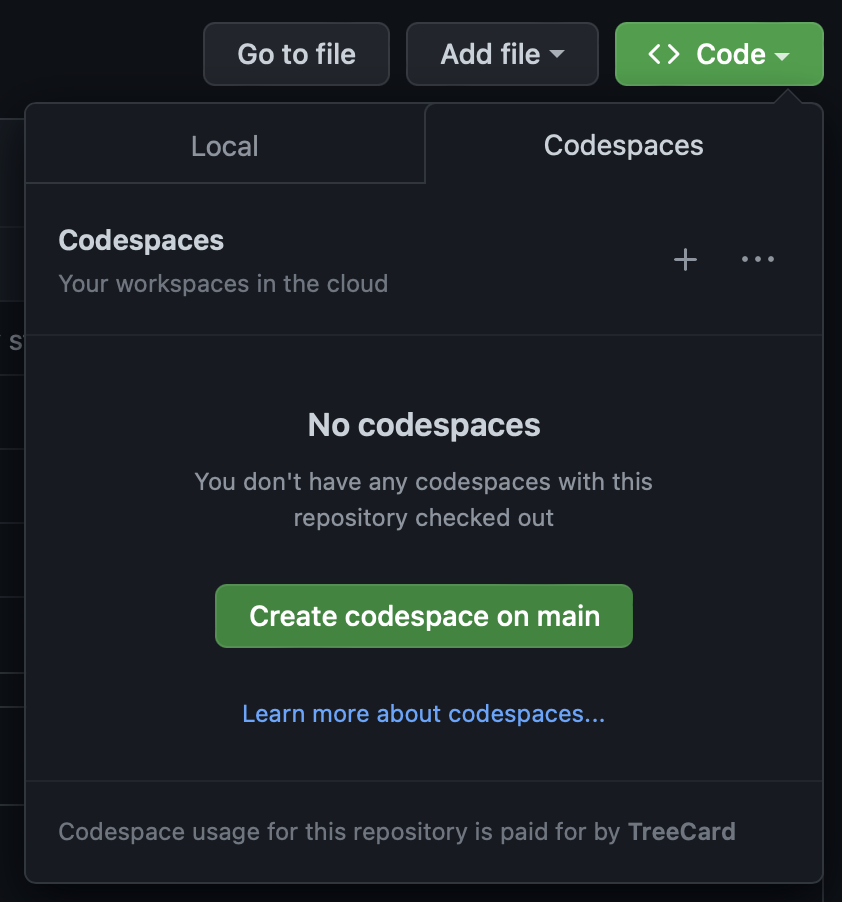

# backend-test

Welcome to the backend task!

1. First create a codespace to edit the code:
<p align="center">
  
</p>


2. Start by looking in the `cache/` directory. 

3. Run the code with:

```sh
go test ./cache -v
```

## Treecard

1. Invite them to collaborate in this repo: https://docs.github.com/en/account-and-profile/setting-up-and-managing-your-personal-account-on-github/managing-access-to-your-personal-repositories/inviting-collaborators-to-a-personal-repository
2. Share their screen, and get them to create a codespace.
3. Walk through the task, commit their work to a branch.
4. After the test, remove them as a collaborator.
